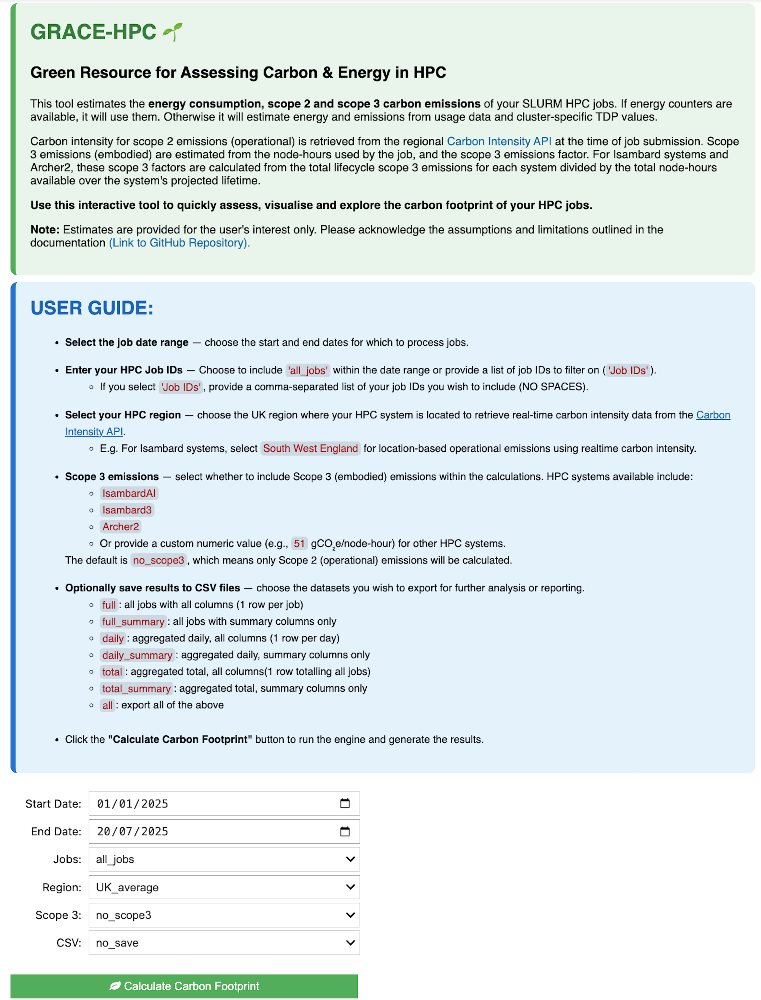

# Jupyter Interface (Interactive)

GRACE-HPC also supports a fully interactive, user friendly **Jupyter Notebook** interface, allowing you to enter the arguments through intuitive widgets and instantly visualise the results. Interactive figures are created using `plotly` providing in-depth insights into the energy and carbon emissions of the users HPC jobs - all within a single `.ipynb` file.

## Setting Up the .ipynb Notebook

1. Launch a `.ipynb` notebook on your HPC system.

2. Ensure the notebook is launched from and running in the [ghpc_env environment](installation.md#virtual-environments), where the gracehpc package is installed.

3. There are many ways to run .ipynb notebooks. We recommend using **VS Code** or **JupyterLab** for the best experience.

### For Isambard Systems

If you're working on **Isambard 3** or **Isambard-AI**, follow this guide to start a JupyterLab session on a compute node: [**JupyterLab Guide**](https://docs.isambard.ac.uk/user-documentation/guides/jupyter/)

> Be sure to use your own `ghpc_env` environment instead of the provided `jupyter-user-environment`. Remember to update the environment name in your job submission script.


Alternatively, you can use the tool in a .ipynb file using VS Code directly on the login node, or follow this guide to start an interactive VS Code session on a compute node: [**VS Code Guide**](https://docs.isambard.ac.uk/user-documentation/guides/vscode/)


## Launch the Interface

Once your `.ipynb` notebook is open and connected to the `ghpc_env` environment, your ready to launch the interactive interface:

```python 
from gracehpc import jupyter_UI

# Generate interface, storing 3 DataFrames in a results dictionary 
results = jupyter_UI()
```

`results` is a dictionary containing the 3 DataFrames discussed in the [Python Usage](function.md#function-returns) section: 

- full_df
- daily_df
- total_df

This allows the user to access the raw data as well as the rich notebook display. Note `results` will only contain the DataFrames once the **Calculate Carbon Footprint** button has been clicked.

*The interface generated:*



The [input arguments](inputs_outputs.md#input-arguments) behave in the same way as the [CLI](cli.md) and [Python Usage](function.md).
Users can easily enter different parameters using the widgets and repeatedly run the tool and instantly visualise the corresponding results.

The video below demonstrates the tool in action within **JupyterLab** on Isambard-AI.


